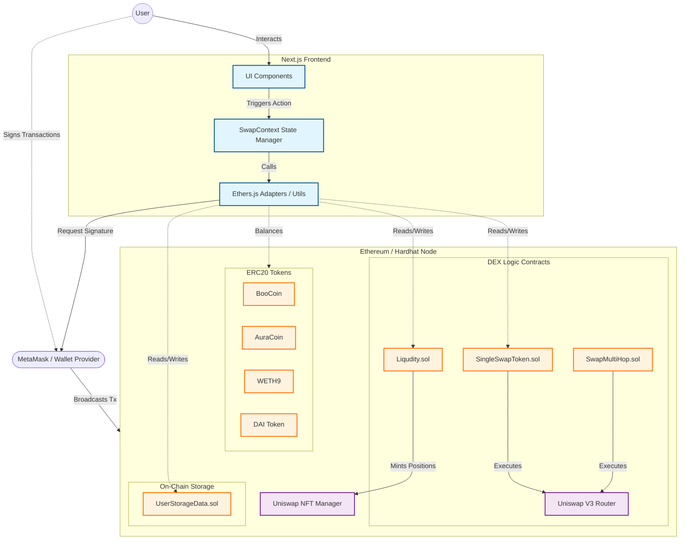

```mermaid
graph TD
    User((User))
    Wallet([MetaMask / Wallet Provider])

    subgraph Frontend["Next.js Frontend"]
        UI[UI Components]
        Context[SwapContext State Manager]
        Utils[Ethers.js Adapters / Utils]
        
        UI -->|Triggers Action| Context
        Context -->|Calls| Utils
    end

    User -->|Interacts| UI
    User -.->|Signs Transactions| Wallet
    Utils -->|Request Signature| Wallet
    Wallet -->|Broadcasts Tx| Blockchain

    subgraph Blockchain["Ethereum / Hardhat Node"]
        direction TB
        
        subgraph Tokens["ERC20 Tokens"]
            Boo[BooCoin]
            Aura[AuraCoin]
            WETH[WETH9]
            DAI[DAI Token]
        end

        subgraph DexLogic["DEX Logic Contracts"]
            Router[Uniswap V3 Router]
            SingleSwap[SingleSwapToken.sol]
            MultiSwap[SwapMultiHop.sol]
            Liquidity[Liqudity.sol]
        end

        subgraph Storage["On-Chain Storage"]
            UserData[UserStorageData.sol]
        end

        SingleSwap -->|Executes| Router
        MultiSwap -->|Executes| Router
        Liquidity -->|Mints Positions| NonFungiblePositionManager[Uniswap NFT Manager]
    end

    Utils -.->|Reads/Writes| SingleSwap
    Utils -.->|Reads/Writes| Liquidity
    Utils -.->|Reads/Writes| UserData
    Utils -.->|Balances| Tokens

    classDef ui fill:#e1f5fe,stroke:#01579b,stroke-width:2px;
    classDef contract fill:#fff3e0,stroke:#ff6f00,stroke-width:2px;
    classDef external fill:#f3e5f5,stroke:#7b1fa2,stroke-width:2px;

    class UI,Context,Utils ui;
    class Boo,Aura,WETH,DAI,SingleSwap,MultiSwap,Liquidity,UserData contract;
    class Router,NonFungiblePositionManager external;
```
